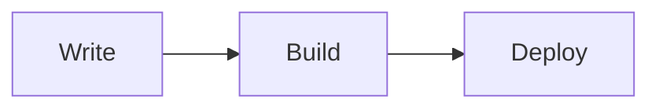

# Code 组件

`Code` 用于展示代码片段，并支持：

- 按 `lang` 显示语言标签和配色（窄屏自动缩写）。
- `lang="mermaid"` 时支持主题预设和源码 / 渲染切换。
- 按 `path` 显示文件路径。
- 标题栏一键复制代码（统一 Toast 反馈）。
- markdown 原生代码块自动套用同一套样式与复制按钮。

## 显示规则

1. markdown 原生代码块：语言显示在左侧。
2. `Code` 未传 `path`：语言显示在左侧。
3. `Code` 传入 `path`：语言显示在复制按钮左侧。
4. 最左侧始终显示当前语言 icon（Iconify）。
5. 竖屏或路径过长（`>70`）时，语言标签自动切换缩写。

## 基础用法

<Code
  lang="ts"
  path="src/components/link-card.ts"
>
export function createCard(title: string, href: string) {
  return { title, href }
}
</Code>

```md
<Code
  lang="ts"
  path="src/components/link-card.ts"
>
export function createCard(title: string, href: string) {
  return { title, href }
}
</Code>
```

## 使用默认插槽传代码

<Code lang="py" path="scripts/math.py">
def add(a: int, b: int) -> int:
    return a + b
</Code>

```md
<Code lang="py" path="scripts/math.py">
def add(a: int, b: int) -> int:
    return a + b
</Code>
```

## markdown 原生代码块（同样样式）

```ts
export function createCard(title: string, href: string) {
  return { title, href }
}
```

````md
```ts
export function createCard(title: string, href: string) {
  return { title, href }
}
```
````

## 支持的语言

<Accordion type="multiple" :default-value="['lang-shell', 'lang-mermaid', 'lang-aliases']">
  <AccordionItem value="lang-text" title="文本与文档" icon="mdi:file-document-outline">
    <Badge size="sm" icon="mdi:file-document-outline">Plain Text · text</Badge>&nbsp;&nbsp;
    <Badge size="sm" icon="simple-icons:markdown">Markdown · md</Badge>&nbsp;&nbsp;
    <Badge size="sm" icon="simple-icons:latex">LaTeX · latex</Badge>
  </AccordionItem>
  <AccordionItem value="lang-web" title="Web 基础" icon="mdi:web">
    <Badge size="sm" icon="simple-icons:html5">HTML · html</Badge>&nbsp;&nbsp;
    <Badge size="sm" icon="simple-icons:css3">CSS · css</Badge>&nbsp;&nbsp;
    <Badge size="sm" icon="simple-icons:sass">SCSS · scss</Badge>&nbsp;&nbsp;
    <Badge size="sm" icon="simple-icons:less">Less · less</Badge>&nbsp;&nbsp;
    <Badge size="sm" icon="mdi:language-javascript">JavaScript · js</Badge>&nbsp;&nbsp;
    <Badge size="sm" icon="mdi:language-typescript">TypeScript · ts</Badge>&nbsp;&nbsp;
    <Badge size="sm" icon="simple-icons:react">JSX · jsx</Badge>&nbsp;&nbsp;
    <Badge size="sm" icon="simple-icons:react">TSX · tsx</Badge>
  </AccordionItem>
  <AccordionItem value="lang-frameworks" title="前端框架与元框架" icon="mdi:layers-outline">
    <Badge size="sm" icon="simple-icons:vuedotjs">Vue · vue</Badge>&nbsp;&nbsp;
    <Badge size="sm" icon="simple-icons:react">React · react / jsx / tsx</Badge>&nbsp;&nbsp;
    <Badge size="sm" icon="simple-icons:svelte">Svelte · svelte</Badge>&nbsp;&nbsp;
    <Badge size="sm" icon="simple-icons:angular">Angular · angular</Badge>&nbsp;&nbsp;
    <Badge size="sm" icon="simple-icons:astro">Astro · astro</Badge>&nbsp;&nbsp;
    <Badge size="sm" icon="simple-icons:jquery">jQuery · jquery</Badge>&nbsp;&nbsp;
    <Badge size="sm" icon="simple-icons:django">Django · django</Badge>&nbsp;&nbsp;
    <Badge size="sm" icon="simple-icons:flutter">Flutter · flutter</Badge>&nbsp;&nbsp;
    <Badge size="sm" icon="simple-icons:mermaid">Mermaid · mermaid</Badge>
  </AccordionItem>
  <AccordionItem value="lang-data" title="数据交换与配置" icon="mdi:cog-outline">
    <Badge size="sm" icon="simple-icons:json">JSON · json</Badge>&nbsp;&nbsp;
    <Badge size="sm" icon="simple-icons:yaml">YAML · yaml</Badge>&nbsp;&nbsp;
    <Badge size="sm" icon="simple-icons:toml">TOML · toml</Badge>&nbsp;&nbsp;
    <Badge size="sm" icon="simple-icons:xml">XML · xml</Badge>&nbsp;&nbsp;
    <Badge size="sm" icon="mdi:file-cog-outline">INI · ini</Badge>&nbsp;&nbsp;
    <Badge size="sm" icon="mdi:file-cog-outline">Properties · properties</Badge>
  </AccordionItem>
  <AccordionItem value="lang-db" title="数据库与查询语言" icon="mdi:database">
    <Badge size="sm" icon="mdi:database">SQL · sql</Badge>&nbsp;&nbsp;
    <Badge size="sm" icon="simple-icons:postgresql">PostgreSQL · pgsql / postgresql</Badge>&nbsp;&nbsp;
    <Badge size="sm" icon="simple-icons:mysql">MySQL · mysql</Badge>&nbsp;&nbsp;
    <Badge size="sm" icon="simple-icons:mariadb">MariaDB · mariadb</Badge>&nbsp;&nbsp;
    <Badge size="sm" icon="mdi:database">SQLite · sqlite</Badge>&nbsp;&nbsp;
    <Badge size="sm" icon="mdi:database">PL/SQL · plsql</Badge>&nbsp;&nbsp;
    <Badge size="sm" icon="mdi:database">HiveQL · hive</Badge>&nbsp;&nbsp;
    <Badge size="sm" icon="mdi:database">Squirrel · squirrel</Badge>
  </AccordionItem>
  <AccordionItem value="lang-general" title="通用编程语言" icon="mdi:code-tags">
    <Badge size="sm" icon="mdi:language-python">Python · py / cpython</Badge>&nbsp;&nbsp;
    <Badge size="sm" icon="mdi:language-c">C · c</Badge>&nbsp;&nbsp;
    <Badge size="sm" icon="mdi:language-cpp">C++ · cpp</Badge>&nbsp;&nbsp;
    <Badge size="sm" icon="mdi:language-java">Java · java</Badge>&nbsp;&nbsp;
    <Badge size="sm" icon="mdi:language-go">Go · go</Badge>&nbsp;&nbsp;
    <Badge size="sm" icon="mdi:language-rust">Rust · rs</Badge>&nbsp;&nbsp;
    <Badge size="sm" icon="mdi:language-php">PHP · php</Badge>&nbsp;&nbsp;
    <Badge size="sm" icon="mdi:language-ruby">Ruby · ruby</Badge>&nbsp;&nbsp;
    <Badge size="sm" icon="simple-icons:dart">Dart · dart</Badge>&nbsp;&nbsp;
    <Badge size="sm" icon="simple-icons:kotlin">Kotlin · kotlin / kt</Badge>&nbsp;&nbsp;
    <Badge size="sm" icon="simple-icons:swift">Swift · swift</Badge>&nbsp;&nbsp;
    <Badge size="sm" icon="simple-icons:scala">Scala · scala</Badge>&nbsp;&nbsp;
    <Badge size="sm" icon="simple-icons:lua">Lua · lua</Badge>&nbsp;&nbsp;
    <Badge size="sm" icon="simple-icons:haskell">Haskell · haskell</Badge>&nbsp;&nbsp;
    <Badge size="sm" icon="simple-icons:ocaml">OCaml · ocaml</Badge>&nbsp;&nbsp;
    <Badge size="sm" icon="simple-icons:julia">Julia · julia</Badge>&nbsp;&nbsp;
    <Badge size="sm" icon="simple-icons:perl">Perl · perl</Badge>
  </AccordionItem>
  <AccordionItem value="lang-science" title="科学计算与教学语言" icon="mdi:function-variant">
    <Badge size="sm" icon="mdi:function-variant">MATLAB · matlab</Badge>&nbsp;&nbsp;
    <Badge size="sm" icon="mdi:sine-wave">Octave · octave</Badge>&nbsp;&nbsp;
    <Badge size="sm" icon="mdi:function-variant">Fortran · fortran</Badge>&nbsp;&nbsp;
    <Badge size="sm" icon="simple-icons:r">R · r</Badge>&nbsp;&nbsp;
    <Badge size="sm" icon="mdi:chart-box-outline">SAS · sas</Badge>&nbsp;&nbsp;
    <Badge size="sm" icon="mdi:chart-line">Stata · stata</Badge>&nbsp;&nbsp;
    <Badge size="sm" icon="mdi:script-text-outline">BASIC · basic</Badge>&nbsp;&nbsp;
    <Badge size="sm" icon="mdi:lambda">Scheme · scheme</Badge>&nbsp;&nbsp;
    <Badge size="sm" icon="mdi:magic-staff">Oz · oz</Badge>&nbsp;&nbsp;
    <Badge size="sm" icon="mdi:alpha-p-box-outline">Pascal · pascal</Badge>&nbsp;&nbsp;
    <Badge size="sm" icon="simple-icons:haxe">Haxe · haxe</Badge>&nbsp;&nbsp;
    <Badge size="sm" icon="mdi:code-json">IDL · idl</Badge>
  </AccordionItem>
  <AccordionItem value="lang-systems" title="系统、构建与服务器" icon="mdi:server-outline">
    <Badge size="sm" icon="mdi:memory">Assembly · assembly</Badge>&nbsp;&nbsp;
    <Badge size="sm" icon="mdi:hammer-wrench">Makefile · make / makefile</Badge>&nbsp;&nbsp;
    <Badge size="sm" icon="mdi:tools">CMake · cmake</Badge>&nbsp;&nbsp;
    <Badge size="sm" icon="simple-icons:nginx">Nginx · nginx</Badge>&nbsp;&nbsp;
    <Badge size="sm" icon="simple-icons:apache">.htaccess · htaccess</Badge>&nbsp;&nbsp;
    <Badge size="sm" icon="mdi:web">HTTP · http / https</Badge>&nbsp;&nbsp;
    <Badge size="sm" icon="mdi:file-code-outline">HXML · hxml</Badge>&nbsp;&nbsp;
    <Badge size="sm" icon="mdi:key-variant">PGP · pgp</Badge>&nbsp;&nbsp;
    <Badge size="sm" icon="mdi:source-branch">PEG.js · pegjs / pegis</Badge>&nbsp;&nbsp;
    <Badge size="sm" icon="simple-icons:stylus">Stylus · stylus</Badge>&nbsp;&nbsp;
    <Badge size="sm" icon="mdi:weather-windy">Velocity · velocity</Badge>&nbsp;&nbsp;
    <Badge size="sm" icon="mdi:timeline-outline">Sequence · sequence</Badge>
  </AccordionItem>
  <AccordionItem value="lang-hardware" title="底层与硬件描述" icon="mdi:chip">
    <Badge size="sm" icon="simple-icons:apple">Objective-C · objc / objective-c</Badge>&nbsp;&nbsp;
    <Badge size="sm" icon="mdi:chip">Verilog · verilog</Badge>&nbsp;&nbsp;
    <Badge size="sm" icon="mdi:chip">SystemVerilog · systemverilog</Badge>&nbsp;&nbsp;
    <Badge size="sm" icon="mdi:chip">VHDL · vhdl</Badge>&nbsp;&nbsp;
    <Badge size="sm" icon="mdi:microsoft-visual-studio">Visual Basic · vb / visual basic</Badge>&nbsp;&nbsp;
    <Badge size="sm" icon="mdi:script-text-outline">VBScript · vbscript</Badge>
  </AccordionItem>
  <AccordionItem value="lang-shell" title="Shell 与终端" icon="mdi:console-line">
    <Badge size="sm" icon="simple-icons:gnubash">Shell · sh</Badge>&nbsp;&nbsp;
    <Badge size="sm" icon="simple-icons:gnubash">Bash · bash</Badge>&nbsp;&nbsp;
    <Badge size="sm" icon="simple-icons:zsh">Zsh · zsh</Badge>&nbsp;&nbsp;
    <Badge size="sm" icon="simple-icons:fishshell">Fish · fish</Badge>&nbsp;&nbsp;
    <Badge size="sm" icon="simple-icons:nushell">Nushell · nu</Badge>&nbsp;&nbsp;
    <Badge size="sm" icon="simple-icons:windows">CMD · cmd</Badge>&nbsp;&nbsp;
    <Badge size="sm" icon="simple-icons:powershell">PowerShell · powershell</Badge>
  </AccordionItem>
  <AccordionItem value="lang-mermaid" title="Mermaid 主题与渲染" icon="simple-icons:mermaid">
    Markdown 原生 `mermaid` fence 会直接渲染图表，但不支持单图主题指定，也不支持源码 / 渲染切换。

    需要主题、切换和组件级控制时，请使用 `Code lang="mermaid"`。
  </AccordionItem>
  <AccordionItem value="lang-aliases" title="常见别名" icon="mdi:swap-horizontal">
    <Badge size="sm" icon="mdi:language-python">python → py</Badge>&nbsp;&nbsp;
    <Badge size="sm" icon="mdi:language-rust">rust → rs</Badge>&nbsp;&nbsp;
    <Badge size="sm" icon="simple-icons:gnubash">shellscript → sh</Badge>&nbsp;&nbsp;
    <Badge size="sm" icon="simple-icons:yaml">yml → yaml</Badge>&nbsp;&nbsp;
    <Badge size="sm" icon="simple-icons:postgresql">postgresql → pgsql</Badge>&nbsp;&nbsp;
    <Badge size="sm" icon="simple-icons:apple">objective-c → objc</Badge>&nbsp;&nbsp;
    <Badge size="sm" icon="simple-icons:powershell">ps1 / pwsh → powershell</Badge>
  </AccordionItem>
</Accordion>

## Shell 与 root 用法

对于 `sh`、`bash`、`zsh`、`fish`、`nu` 这类 shell 语言：

- 默认会在每行前显示 `$`
- 如果需要表示必须使用 `root` 用户执行，可以写成 `<语言>-root`
- `-root` 会额外显示一个 `root` badge，并把每行前缀切换为 `#`
- 这些前缀是界面装饰，不会被复制按钮或鼠标拖拽复制进剪贴板

### Markdown 原生代码块

```bash-root
apt update
apt install -y nginx
systemctl restart nginx
```

````md
```bash-root
apt update
apt install -y nginx
systemctl restart nginx
```
````

### `Code` 组件写法

<Code
  lang="zsh-root"
  path="scripts/bootstrap.zsh"
  :code="`brew update
brew install bun
source ~/.zshrc`"
/>

```md
<Code
  lang="zsh-root"
  path="scripts/bootstrap.zsh"
  :code="`brew update
brew install bun
source ~/.zshrc`"
/>
```

## Mermaid 渲染与主题

Mermaid 现在分两条能力线：

- Markdown 原生 `mermaid` fence：直接渲染图表，适合最轻量的文档写法。
- `Code lang="mermaid"`：支持 `mermaidTheme` 指定主题预设，支持 `mermaidView="code | render"` 指定默认视图，并可在“源码 / 渲染”之间切换。

这些主题预设整理自 [Nexmoe 的极简主题文章](https://nexmoe.com/zh/posts/mermaid-theme/)、[掘金的主题合集](https://juejin.cn/post/7525324923222818826)，并按 [Mermaid 官方 Theming 文档](https://mermaid.js.org/config/theming.html) 接入。需要注意的是：官方只允许在 `base` 主题上通过 `themeVariables` 做自定义；`handdrawn-pastel` 额外使用了 `look: 'handDrawn'`。

### Markdown 原生渲染

Markdown 原生 `mermaid` fence 会直接渲染为图，而不是普通代码块：



这种写法不支持组件级主题指定，也不支持源码 / 渲染切换。

### `Code` 组件：主题指定与源码 / 渲染切换

<Code
  lang="mermaid"
  mermaid-theme="pure-white"
  mermaid-view="render"
  path="docs/diagram/overview.mmd"
  :code="[
    'flowchart LR',
    '  A[Write] --> B[Build]',
    '  B --> C[Review]',
    '  C --> D[Deploy]'
  ].join('\n')"
/>

```md
<Code
  lang="mermaid"
  mermaid-theme="pure-white"
  mermaid-view="render"
  path="docs/diagram/overview.mmd"
  :code="`flowchart LR
  A[Write] --> B[Build]
  B --> C[Review]
  C --> D[Deploy]`"
/>
```

### 主题预设

下面每个主题都给出真实预览，便于直接对比样式差异。

<Accordion
  type="multiple"
  :default-value="['mermaid-pure-white', 'mermaid-business-soft', 'mermaid-handdrawn-pastel', 'mermaid-tech-ice']"
>
  <AccordionItem value="mermaid-default" title="default" icon="simple-icons:mermaid">
    <Badge size="sm" icon="simple-icons:mermaid">官方内置</Badge>
    <Code
      lang="mermaid"
      mermaid-theme="default"
      mermaid-view="render"
      :code="[
        'flowchart LR',
        '  Client[客户端] --> Gateway{网关}',
        '  Gateway --> ServiceA[服务 A]',
        '  Gateway --> ServiceB[服务 B]',
        '  ServiceA --> DB[(数据库)]',
        '  ServiceB --> DB'
      ].join('\n')"
    />
  </AccordionItem>
  <AccordionItem value="mermaid-neutral" title="neutral" icon="simple-icons:mermaid">
    <Badge size="sm" icon="simple-icons:mermaid">官方内置</Badge>
    <Code
      lang="mermaid"
      mermaid-theme="neutral"
      mermaid-view="render"
      :code="[
        'flowchart LR',
        '  Client[客户端] --> Gateway{网关}',
        '  Gateway --> ServiceA[服务 A]',
        '  Gateway --> ServiceB[服务 B]',
        '  ServiceA --> DB[(数据库)]',
        '  ServiceB --> DB'
      ].join('\n')"
    />
  </AccordionItem>
  <AccordionItem value="mermaid-dark" title="dark" icon="simple-icons:mermaid">
    <Badge size="sm" icon="simple-icons:mermaid">官方内置</Badge>
    <Code
      lang="mermaid"
      mermaid-theme="dark"
      mermaid-view="render"
      :code="[
        'flowchart LR',
        '  Client[客户端] --> Gateway{网关}',
        '  Gateway --> ServiceA[服务 A]',
        '  Gateway --> ServiceB[服务 B]',
        '  ServiceA --> DB[(数据库)]',
        '  ServiceB --> DB'
      ].join('\n')"
    />
  </AccordionItem>
  <AccordionItem value="mermaid-forest" title="forest" icon="simple-icons:mermaid">
    <Badge size="sm" icon="simple-icons:mermaid">官方内置</Badge>
    <Code
      lang="mermaid"
      mermaid-theme="forest"
      mermaid-view="render"
      :code="[
        'flowchart LR',
        '  Client[客户端] --> Gateway{网关}',
        '  Gateway --> ServiceA[服务 A]',
        '  Gateway --> ServiceB[服务 B]',
        '  ServiceA --> DB[(数据库)]',
        '  ServiceB --> DB'
      ].join('\n')"
    />
  </AccordionItem>
  <AccordionItem value="mermaid-pure-white" title="纯白简约风（pure-white）" icon="mdi:palette-outline">
    <Badge size="sm" icon="simple-icons:mermaid">来源：Nexmoe</Badge>
    <Code
      lang="mermaid"
      mermaid-theme="pure-white"
      mermaid-view="render"
      :code="[
        'flowchart LR',
        '  Client[客户端] --> Gateway{网关}',
        '  Gateway --> ServiceA[服务 A]',
        '  Gateway --> ServiceB[服务 B]',
        '  ServiceA --> DB[(数据库)]',
        '  ServiceB --> DB'
      ].join('\n')"
    />
  </AccordionItem>
  <AccordionItem value="mermaid-business-soft" title="淡雅商务风（business-soft）" icon="mdi:briefcase-outline">
    <Badge size="sm" icon="simple-icons:mermaid">来源：Nexmoe</Badge>
    <Code
      lang="mermaid"
      mermaid-theme="business-soft"
      mermaid-view="render"
      :code="[
        'flowchart LR',
        '  Client[客户端] --> Gateway{网关}',
        '  Gateway --> ServiceA[服务 A]',
        '  Gateway --> ServiceB[服务 B]',
        '  ServiceA --> DB[(数据库)]',
        '  ServiceB --> DB'
      ].join('\n')"
    />
  </AccordionItem>
  <AccordionItem value="mermaid-macaron-gradient" title="马卡龙渐变风（macaron-gradient）" icon="mdi:palette-swatch-outline">
    <Badge size="sm" icon="simple-icons:mermaid">来源：掘金</Badge>
    <Code
      lang="mermaid"
      mermaid-theme="macaron-gradient"
      mermaid-view="render"
      :code="[
        'flowchart LR',
        '  Client[客户端] --> Gateway{网关}',
        '  Gateway --> ServiceA[服务 A]',
        '  Gateway --> ServiceB[服务 B]',
        '  ServiceA --> DB[(数据库)]',
        '  ServiceB --> DB'
      ].join('\n')"
    />
  </AccordionItem>
  <AccordionItem value="mermaid-handdrawn-pastel" title="手绘彩笔风（handdrawn-pastel）" icon="mdi:brush-variant">
    <Badge size="sm" icon="simple-icons:mermaid">来源：掘金</Badge>
    <Code
      lang="mermaid"
      mermaid-theme="handdrawn-pastel"
      mermaid-view="render"
      :code="[
        'flowchart LR',
        '  Client[客户端] --> Gateway{网关}',
        '  Gateway --> ServiceA[服务 A]',
        '  Gateway --> ServiceB[服务 B]',
        '  ServiceA --> DB[(数据库)]',
        '  ServiceB --> DB'
      ].join('\n')"
    />
  </AccordionItem>
  <AccordionItem value="mermaid-tech-ice" title="冰蓝理工风（tech-ice）" icon="mdi:snowflake">
    <Badge size="sm" icon="simple-icons:mermaid">来源：掘金</Badge>
    <Code
      lang="mermaid"
      mermaid-theme="tech-ice"
      mermaid-view="render"
      :code="[
        'flowchart LR',
        '  Client[客户端] --> Gateway{网关}',
        '  Gateway --> ServiceA[服务 A]',
        '  Gateway --> ServiceB[服务 B]',
        '  ServiceA --> DB[(数据库)]',
        '  ServiceB --> DB'
      ].join('\n')"
    />
  </AccordionItem>
  <AccordionItem value="mermaid-ethereal-purple" title="紫气东来梦幻风（ethereal-purple）" icon="mdi:creation-outline">
    <Badge size="sm" icon="simple-icons:mermaid">来源：掘金</Badge>
    <Code
      lang="mermaid"
      mermaid-theme="ethereal-purple"
      mermaid-view="render"
      :code="[
        'flowchart LR',
        '  Client[客户端] --> Gateway{网关}',
        '  Gateway --> ServiceA[服务 A]',
        '  Gateway --> ServiceB[服务 B]',
        '  ServiceA --> DB[(数据库)]',
        '  ServiceB --> DB'
      ].join('\n')"
    />
  </AccordionItem>
</Accordion>

如果你只想展示 Mermaid 源码本身，而不是渲染图，可以继续使用 `Code` 组件的默认行为，或者显式写 `mermaid-view="code"`：

```md
<Code lang="mermaid" :code="`flowchart LR
  A[Write] --> B[Build]
  B --> C[Deploy]`" />
```

## 自动换行与自定义强调色

<Code
  lang="json"
  path="config/site.json"
  :wrap="true"
  color="#00a7b7"
>
{
  "title": "Demo",
  "description": "A long text for wrapping demo with automatic line wrapping enabled"
}
</Code>

## 隐藏行号与禁用复制

<Code lang="ts" :hide-line-numbers="true" :disable-copy="true">
const status = 'display-only'
console.log(status)
</Code>

## Props

| 参数 | 类型 | 默认值 | 说明 | 示例 |
| --- | --- | --- | --- | --- |
| `lang` | `string` | `text` | 语言标识，会影响标签和强调色。 | `lang="ts"` |
| `path` | `string` | `''` | 显示文件路径。 | `path="src/utils/math.ts"` |
| `title` | `string` | `''` | 未传 `path` 时可用作标题。 | `title="示例代码"` |
| `code` | `string` | `''` | 代码文本；不传则读取默认插槽。 | `:code="'const sum = 1 + 2'"` |
| `icon` | `string` | `''` | 覆盖默认语言图标。 | `icon="mdi:code-tags"` |
| `wrap` | `boolean` | `false` | 是否自动换行。 | `:wrap="true"` |
| `color` | `string` | `''` | 自定义强调色。 | `color="#00a7b7"` |
| `hideLineNumbers` | `boolean` | `false` | 隐藏左侧行号。 | `:hide-line-numbers="true"` |
| `disableCopy` | `boolean` | `false` | 隐藏复制按钮并禁用复制行为。 | `:disable-copy="true"` |
| `mermaidTheme` | `string` | `default` | 仅 `lang="mermaid"` 生效，指定 Mermaid 主题预设。 | `mermaid-theme="tech-ice"` |
| `mermaidView` | `'code' \| 'render'` | `code` | 仅 `lang="mermaid"` 生效，指定默认显示源码还是渲染图。 | `mermaid-view="render"` |
